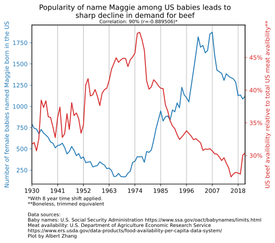

# Astrostatistics Labs

My work for the (excellent) Astrostatistics course at Columbia taught by
[David Kipping](https://www.astro.columbia.edu/content/david-kipping) and
[David Yahalomi](https://www.danielyahalomi.com/).

Labs 2-4 done in collaboration with Ceasar Stringfield.  
Labs 3-4 done in collaboration with Ceasar Stringfield and Nitya Nigam.

Code is my own.  
Provided as reference. NOT for redistribution or reuse.

## Table of Contents

<table>
  <tr align="center">
      <th colspan="2"><a href="LAB1/">Lab 1</a></th>
      <th colspan="2"><a href="LAB1/">Lab 1 Part 2</a></th>
      <th colspan="2"><a href="LAB2/">Lab 2</a></th>
  </tr>
  <tr align="center">
      <td>
          <a href="LAB1/LAB1.ipynb"><b>Code</b></a>
      </td>
      <td>
          <a href="LAB1/LAB1_Summary.pdf"><b>Slides</b></a>
      </td>
      <td>
          <a href="LAB1/LAB1_MDWARF.ipynb"><b>Code</b></a>
      </td>
      <td>
          <a href="LAB1/LAB1_Summary.pdf"><b>Slides</b></a>
      </td>
      <td>
          <a href="LAB2/LAB2.ipynb"><b>Code</b></a>
      </td>
      <td>
          <a href="LAB2/LAB2_Summary.pdf"><b>Slides</b></a>
      </td>
  </tr>
  <tr>
      <td colspan="2">
          Determining Hubble's Constant
      </td>
      <td colspan="2">
          M-Dwarf Mass-Radius Relation
      </td>
      <td colspan="2">
          Temperature of a Cold Brown Dwarf
      </td>
  </tr>
  <tr>
      <td colspan="2">
          Linear Regression
      </td>
      <td colspan="2">
          Linear Regression
      </td>
      <td colspan="2">
          MCMC
      </td>
  </tr>
  <tr>
      <td colspan="2">
          numpy, scipy
      </td>
      <td colspan="2">
          numpy, scipy
      </td>
      <td colspan="2">
          numba, zarr
      </td>
  </tr>
  <tr>
      <td colspan="2">
          

              <a href="LAB1/LAB1.ipynb">
                  </img>
              </a>
          

      </td>
      <td colspan="2">
          

            <a href="LAB1/LAB1_MDWARF.ipynb">
              </img>
            </a>
          

      </td>
      <td colspan="2">
          

            <a href="LAB2/LAB2.ipynb">
              </img>
            </a>
          

      </td>
  </tr>
  <tr align="center">
      <th colspan="2"><a href="LAB3/">Lab 3</a></th>
      <th colspan="2"><a href="LAB4/">Lab 4</a></th>
      <th colspan="2"><a href="INDEP_PROJ/">Final Project</a></th>
  </tr>
  <tr align="center">
      <td>
          <a href="LAB3/LAB3.ipynb"><b>Code</b></a>
      </td>
      <td>
          <a href="LAB3/LAB3_Summary.pdf"><b>Slides</b></a>
      </td>
      <td>
          <a href="LAB4/LAB4.ipynb"><b>Code</b></a>
      </td>
      <td>
          <a href="LAB4/LAB4_Summary.pdf"><b>Slides</b></a>
      </td>
      <td>
          <a href="INDEP_PROJ/model_subm.ipynb"><b>Code</b></a>
      </td>
      <td>
          <a href="INDEP_PROJ/report/indep_project.pdf"><b>Report</b></a>
      </td>
  </tr>
  <tr>
      <td colspan="2">
          Fitting an artifical transit light curve
      </td>
      <td colspan="2">
          Modeling an exoplanet system from radial velocity
      </td>
      <td colspan="2">
          Transit light curve fitting of Earth-like exoplanet candidate Kepler-452b
      </td>
  </tr>
  <tr>
      <td colspan="2">
          Detrending, cleaning, MCMC
      </td>
      <td colspan="2">
          Model Selection, Cross Validation
      </td>
      <td colspan="2">
          MCMC
      </td>
  </tr>
  <tr>
      <td colspan="2">
          numpy, pandas, custom MCMC
      </td>
      <td colspan="2">
          numpy, scipy
      </td>
      <td colspan="2">
          batman, emcee
      </td>
  </tr>
  <tr>
      <td colspan="2">
          

            <a href="LAB3/LAB3.ipynb"></img></a>
          

      </td>
      <td colspan="2">
         
<a href="LAB4/LAB4.ipynb"></img></a>

      </td>
      <td colspan="2">
        
<a href="INDEP_PROJ/report/indep_project.pdf"></img></a>

      </td>
  </tr>
</table>

## For Fun (Mini-Assignment 2)

Finding spurious correlations. [Notebook](mini2/spurious.ipynb)

<a href="mini2/spurious.ipynb"></img></a>

